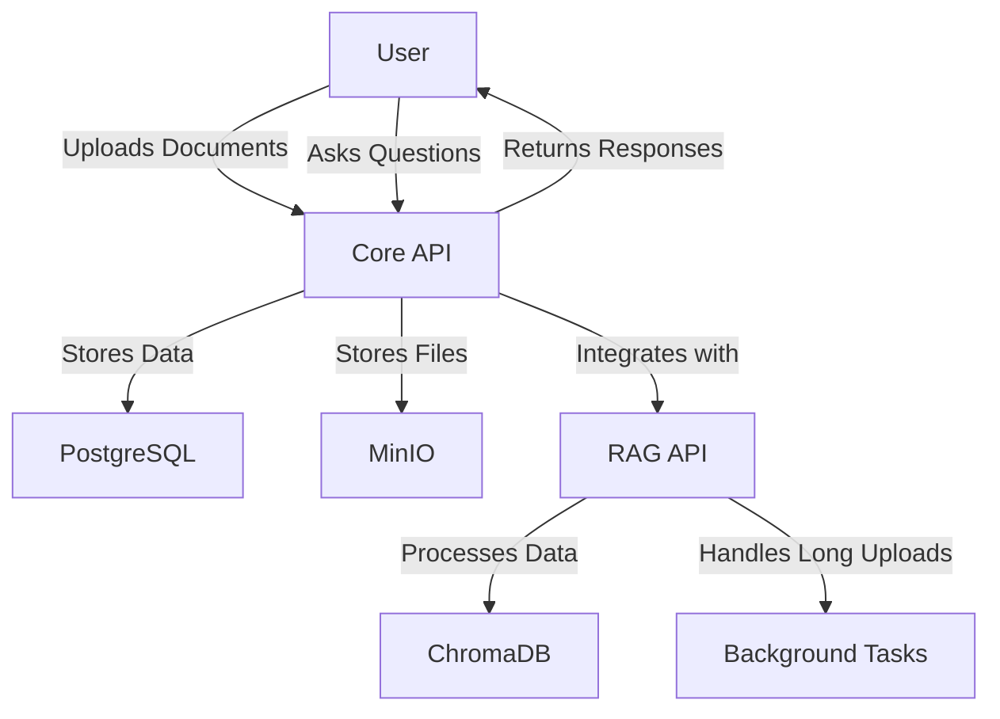
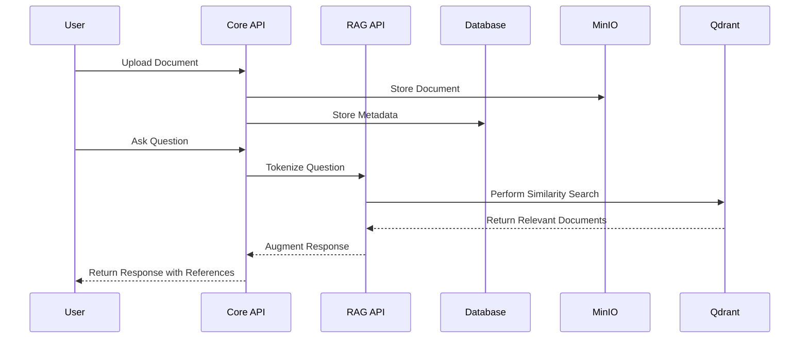

# Rag4Jiya Project

## Table of Contents

- [Overview](#overview)
- [Features](#features)
- [Architecture](#architecture)
  - [Core API](#core-api)
  - [RAG API](#rag-api)
  - [Additional Considerations](#additional-considerations)
- [Process Flow](#process-flow)
  - [User Story](#user-story)
- [Database Schema](#database-schema)
  - [Users Table](#users-table)
  - [Document Types Table](#document-types-table)
  - [Documents Table](#documents-table)
  - [Conversations Table](#conversations-table)
  - [Message Roles Table](#message-roles-table)
  - [Messages Table](#messages-table)
- [Progress Checklist](#progress-checklist)

## Overview

Rag4Jiya is a chatbot-based knowledge management system designed to empower users to upload documents, ask questions, and receive augmented responses based on their knowledge base. This project leverages advanced tokenization and similarity search techniques to provide accurate and relevant information.

## Features

- **User Management**: Secure user registration and authentication.
- **Document Upload**: Users can upload various document types (e.g., transes, handbooks).
- **Tokenization and Chunking**: Automatically processes uploaded documents for efficient storage and retrieval.
- **Chat Functionality**: Users can interact with the chatbot to ask questions and receive answers based on their knowledge base.
- **Similarity Search**: Utilizes vector database to find relevant documents based on user queries.

## Architecture

### Core API

- **Framework**: NestJS
- **Database**: Connected with PostgreSQL for relational data storage.
- **Object Storage**: Connected with MinIO for storing large files and documents.
- **RAG API Integration**: Connects with the RAG API for retrieval-augmented generation tasks.
- **Data Management**: Manages user accounts, document uploads, document types, conversations, message roles, and messages.
- **Authentication**: Implement JWT or OAuth for secure user authentication and authorization.
- **Error Handling**: Implement centralized error handling and logging for better debugging and monitoring.

### RAG API

- **Framework**: FastAPI
- **Vector Database**: Connected with Qdrant for vector storage and similarity search.
- **Background Processing**: Handles long uploads using background tasks (e.g., Celery or RQ) and a task queue (e.g., Redis).
- **Tokenization and Chunking**: Processes uploaded documents into manageable chunks for efficient storage and retrieval.
- **Response Augmentation**: Integrates with the Core API to retrieve relevant documents for user queries.

### Additional Considerations

- **Scalability**: Ensure both APIs are designed to scale horizontally, allowing for increased load handling.
- **Caching**: Implement caching strategies (e.g., Redis) to improve response times for frequently accessed data.
- **API Documentation**: Use tools like Swagger or Postman for API documentation to facilitate easier integration and testing.
- **Testing**: Implement unit and integration tests for both APIs to ensure reliability and maintainability.

## Process Flow

1. **Document Upload**: Users upload documents to their knowledge base.
2. **Tokenization and Chunking**: The system tokenizes and chunks the documents for efficient processing.
3. **Storage**: Documents are stored using Qdrant.
4. **User Interaction**: Users navigate to the chat page and ask questions.
5. **Query Processing**: The system tokenizes the question and performs a similarity search in the knowledge base.
6. **Response Generation**: The system retrieves 5 relevant references and augments the AI response with these references.
7. **Chatbot Reply**: The chatbot replies to the user, including the references.

### User Story

## Database Schema

### Users Table

- **id**: Unique identifier for the user
- **first_name**: User's first name
- **last_name**: User's last name
- **email**: User's email address
- **password**: User's password
- **refresh_token**: Token for refreshing user sessions
- **created_at**: Timestamp of user creation
- **updated_at**: Timestamp of last update

### Document Types Table

- **id**: Unique identifier for the document type
- **name**: Name of the document type (e.g., transes, handbook)
- **description**: Description of the document type
- **created_at**: Timestamp of creation
- **updated_at**: Timestamp of last update

### Documents Table

- **id**: Unique identifier for the document
- **title**: Title of the document
- **filename**: Name of the uploaded file
- **user_id**: ID of the user who uploaded the document
- **document_type_id**: ID of the document type
- **created_at**: Timestamp of creation
- **updated_at**: Timestamp of last update

### Conversations Table

- **id**: Unique identifier for the conversation
- **user_id**: ID of the user involved in the conversation
- **title**: Title of the conversation

### Message Roles Table

- **id**: Unique identifier for the message role
- **name**: Name of the role
- **description**: Description of the role

### Messages Table

- **id**: Unique identifier for the message
- **content**: Content of the message
- **conversation_id**: ID of the conversation
- **message_role_id**: ID of the message role

## Progress Checklist

### **Core API**

- [x] Set up database schema
- [x] Implement user registration and authentication
- [x] Develop document upload functionality

### **RAG API**

- [x] Add health check
- [x] Add vector database repository
- [x] Integrate Qdrant for vector database repository
- [x] Add embedding repository
- [x] Add vector database repository
- [ ] Implement chunking logic and tokenization
- [ ] Implement similarity search for user queries
- [ ] Develop chatbot functionality
